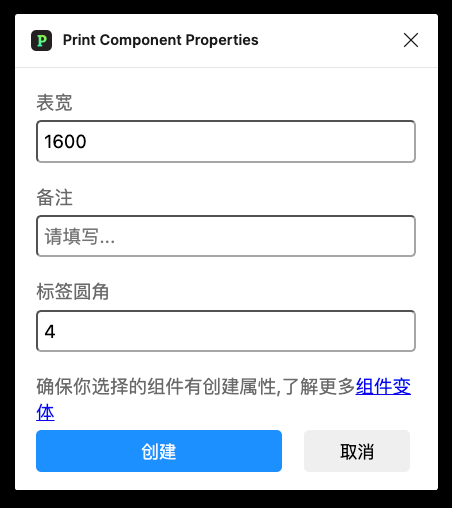

# 使用手册

01. 下载插件安装包到本地

02. Figma 选择开发->通过manifest文件导入插件

03. 选择manifest.josn文件打开

04. 选择运行插件

----

# 功能介绍

01. Step01: 选择组件运行脚本（确保其配置有属性否则会报错）

02. Step02: 设置表宽、备注占位描述、标签圆角属性，点击创建

03. Step03: 默认在组件左边创建表格

04. Step04: 修改你的描述文案

